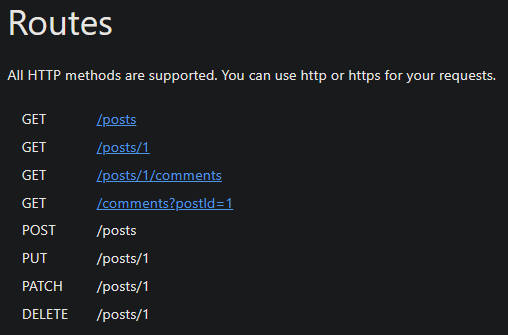
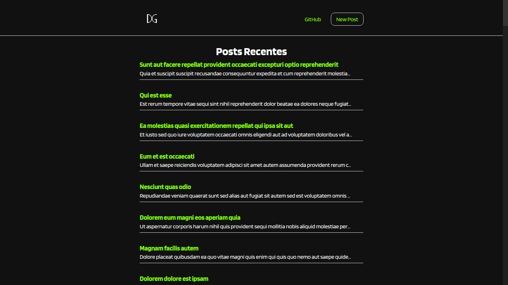
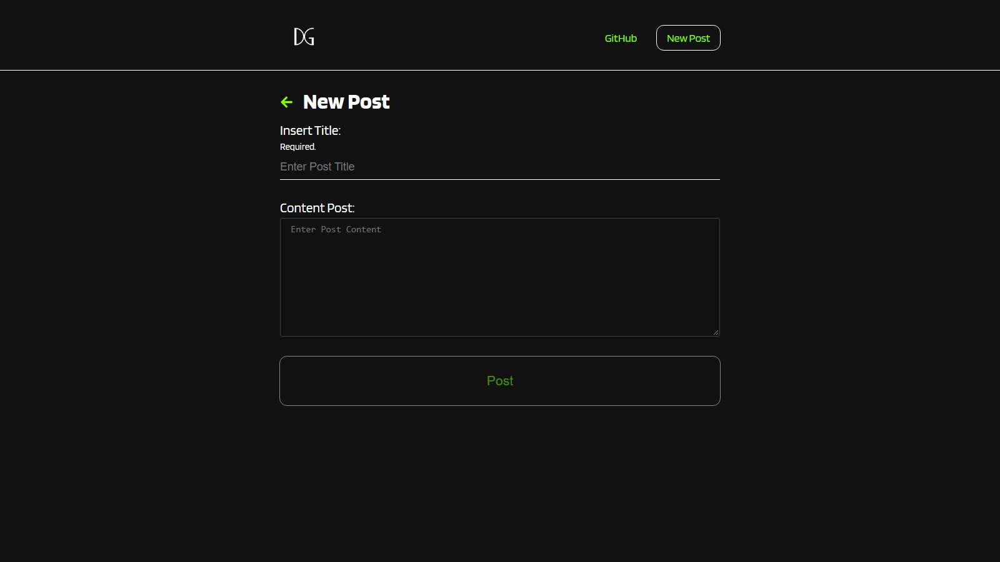
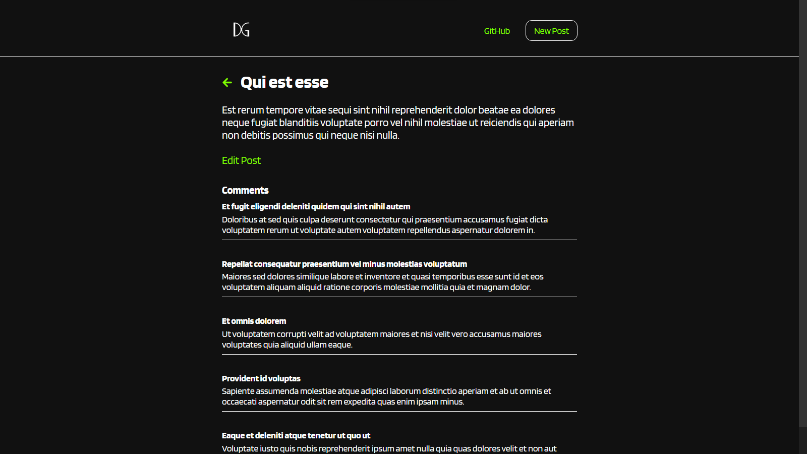
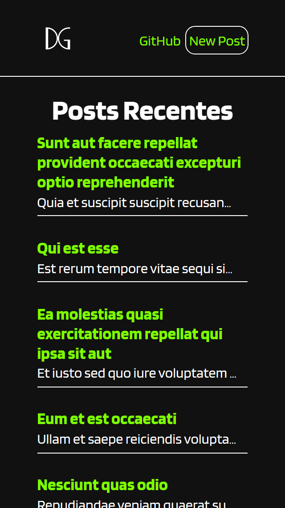
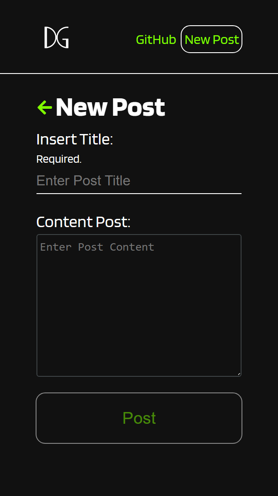
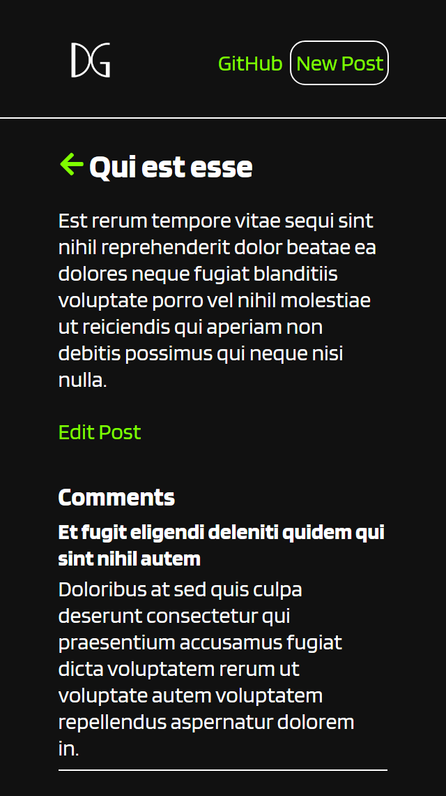

# CRUD Blog Posts

Projeto de estudo com o objetivo de simular um CRUD usando a API [JSONPlaceholder](https://jsonplaceholder.typicode.com/).

O principal objetivo deste estudo era construir um header fixo e mudar o conteúdo principal da página de acordo com a URL.
Para esse fim utilizei do React-router-dom.

### Routas da API [JSONPlaceholder](https://jsonplaceholder.typicode.com/)

obs. A API [JSONPlaceholder](https://jsonplaceholder.typicode.com/) foi utilizada para simular uma conexão com banco de dados. Portanto, não é efetivamente possível realizar um POST, UPDATE ou DELETE na aplicação.

## Images

### Desktop

### Mobile

